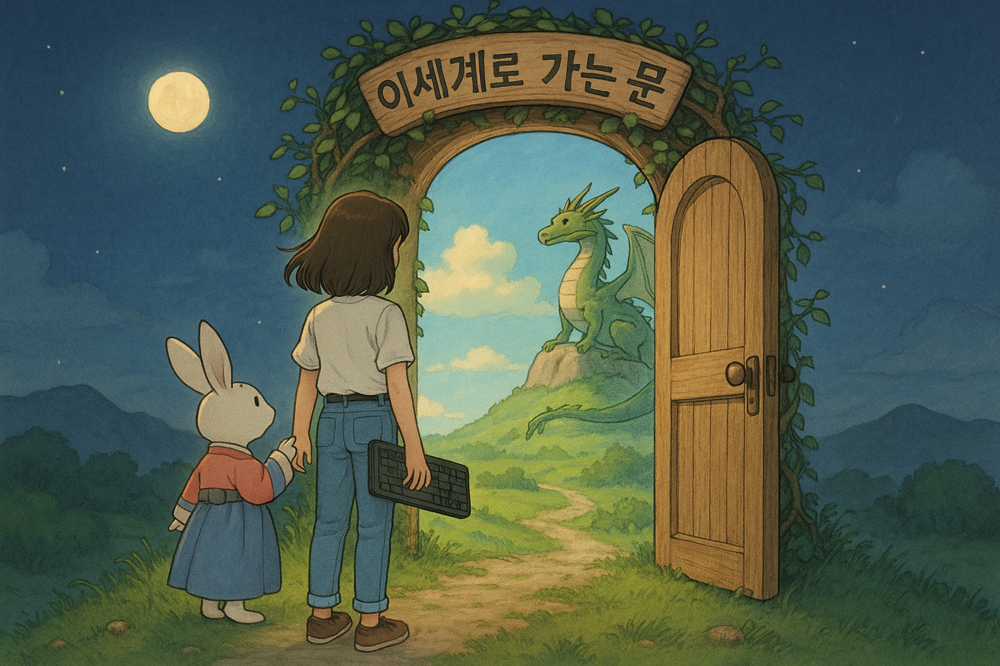

# Door to isekai Project

## What is this?
- Problem:  
  AI(LLM) doesn't understand unreal project and editor.  
  We need AI to make game world.  
- Solution:  
  'Door to isekai' UnrealEngine Plugin allows AIs(gpt,claude,gemini) to control the Unreal Engine editor.  
  It's the Unreal version of what's known as Vibe Coding.  
  AIs can understand and manipulate unreal project using this tool.  

## Manual  
- [Install doc](docs/install/install.md)
- [how to use doc](docs/howtouse/howtouse.md)

## Youtube Example
- [Youtube](https://www.youtube.com/@creatorsoul804/videos)

## Your Voice  
Please leave your comments on the github issue. [here](https://github.com/LSG7/UnrealEngine_AI_Bridge/issues)
We can make isekai
